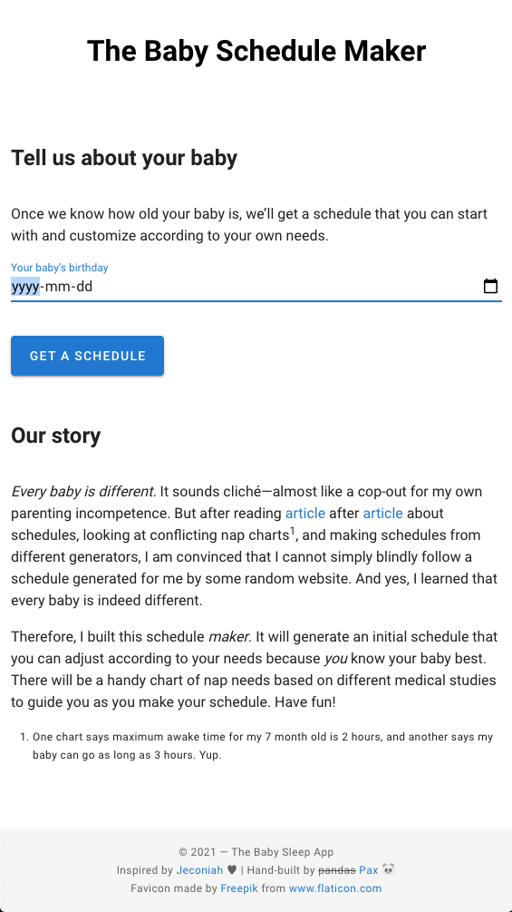
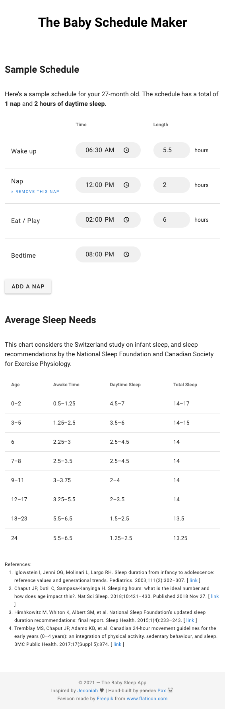

# Baby Sleep Schedule Maker
*A hobby project to gain hands-on learning experience with [Nuxt.js](https://nuxtjs.org/), [Flask](https://flask.palletsprojects.com/), and deploying to [Netlify](https://netlify.com) and [Heroku](https://heroku.com). I also needed a schedule generator for my baby back in 2018.* 🥰

This page generates a sample nap schedule. Unlike most, if not all, baby schedule generators, the schedule is customizable:

- The time and length of naps or awake times can be adjusted.
- Naps can be added or removed.






## Development

### Frontend

Requires at least node v.14

``` bash
# install dependencies
$ npm install

# serve with hot reload at localhost:3000
$ npm run dev

# build for production and launch server
$ npm run build
$ npm run start

# generate static project
$ npm run generate
```

For a detailed explanation on how things work, check out [Nuxt.js docs](https://nuxtjs.org).

### Backend

1. Install [poetry](https://python-poetry.org/)
2. Run the following commands

```bash
# create and activate the virtual environment
$ poetry shell

# install dependencies
$ poetry install
```

#### Testing

[pytest](https://docs.pytest.org/) is used to test the API.

1. If virtual environment is not yet activated, run `poetry shell`
2. Run tests: `pytest`
